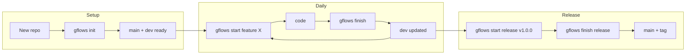
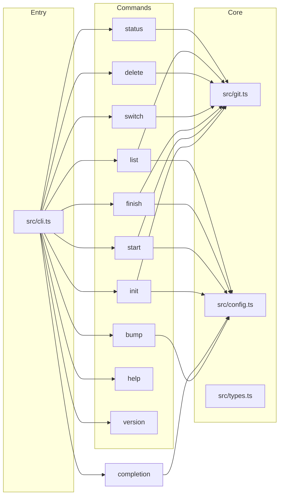

# Modern Git Flows CLI

---

## Plan at a glance

**Is the plan ready?** Yes. The plan is implementation-ready: it defines commands, branch rules, safety guards, config, publishing, tests, and a clear 21-step implementation order. You can start building from step 1; no further design decisions are required unless you choose to drop or defer optional items (e.g. spike type, shell completion).

**What you get**

- A single CLI: `gflows <command> [type] [name] [flags]` with **init**, **start**, **finish**, **switch**, **delete**, **list**, **status**, **completion**, **help**, **version**.
- Branch model: long-lived **main** + **dev**; short-lived **feature**, **bugfix**, **chore**, **release**, **hotfix** (and optional **spike**), each with clear merge targets and optional configurable prefixes.
- Safety: typed errors, exit codes, dirty-tree and main/dev guards, no history rewriting.
- Publish: one internal script for **npm** and **JSR** with version sync and dry-run.
- Interactive UX: **@inquirer/prompts** for pickers and confirmations; scriptable when not TTY.

**Contents** — Vision and principles; Current state; Repository structure; Architecture; Branch rules and CLI (quick reference, parsing, config); Error handling and exit codes; Scripting and CI; Production readiness (guards, validation, conflict/pre-checks/merge); Package.json and runnability; Internal publish script; bump command; File layout; Implementation order (21 steps); Testing; README; Edge cases.

**To-dos** — The single source of truth is the **frontmatter `todos`** (21 items). The numbered **Implementation order** section below matches them; use it for sequence and details.

---

## Vision and principles

**Purpose**: One CLI to bootstrap and run a consistent Git branching workflow: long-lived `main` (production) and `dev` (integration), plus short-lived workflow branches with clear merge targets. Reduces human error and supports both interactive use and CI/scripts.

**Audience**: Small to mid-size teams (or solo devs) who want a lightweight, convention-based flow without a heavy Git GUI or complex Git Flow tooling.

**Design principles**:

- **Organized and lightweight**: Flat, shallow layout; minimal dependencies (Bun + TypeScript only; no CLI framework); no build step for the CLI (run TS directly); single entrypoint; only ship source and minimal config to registries.
- **Scriptable first**: All commands support non-interactive use (`--yes`, no pickers when not TTY); exit codes and stdout are predictable for piping and CI.
- **Safe by default**: No history rewriting; refuse dirty working tree on start unless `--force`; finish fails on merge conflicts (user resolves manually).
- **Minimal config**: Sensible defaults (`main`, `dev`, `origin`); override via repo config file or env only when needed.
- **Conventional naming**: Branch types and prefixes are fixed; version format for release/hotfix is strict (`vX.Y.Z` or `X.Y.Z`) so tooling can parse them.

**User journey (high level)**:

1. New repo → `gflows init` (ensure main, create dev).
2. Work on a feature → `gflows start feature my-feat` → code → `gflows finish feature` (merge to dev, optional push).
3. Release → `gflows start release v1.2.0` → version bump / changelog → `gflows finish release` (merge to main + dev, tag, push).
4. Production fix → `gflows start hotfix v1.2.1` → fix → `gflows finish hotfix` (merge to main + dev, tag, push).




---

## Current state

- **Repo**: Fresh Bun + TypeScript app with a single [src/index.ts](src/index.ts) (“Hello via Bun!”) and [package.json](package.json) (no `scripts` or `bin` yet).
- **Stack**: Bun runtime, TypeScript (strict), ESM. No existing CLI or git logic.

## Repository structure: organized and lightweight

- **Layout**: One `src/` tree (no nested packages); one `scripts/` for repo-only tooling (e.g. publish); one `tests/` for all tests. No monorepo, no workspace packages.
- **Dependencies**: One runtime dependency for interactive UIs: **@inquirer/prompts** (select, confirm). Dev only: `@types/bun`, `typescript`. Otherwise CLI uses Bun and Node built-ins (`util`, `process`). Use `select` for branch pickers and `confirm` for yes/no prompts; only run prompts when stdin is a TTY and flags don’t skip them.
- **No build step**: CLI runs via `bun run src/cli.ts` or `bun src/cli.ts`; package publishes TypeScript source so npm/JSR consumers can use it with Bun or compatible runtimes. No `dist/`, no bundling for the default path.
- **Single entry**: One CLI entry (`src/cli.ts`); `package.json` `bin` and JSR `exports` point at it. Optional `src/index.ts` re-exports for programmatic use only.
- **Package footprint**: `package.json` `files` (e.g. `["src", "README.md"]`) so only source and docs are published; exclude `scripts/`, `tests/`, config files.

## Architecture




- **Entry**: Parse `Bun.argv.slice(2)` with `util.parseArgs`; resolve `-C`/`--path` first so all git and config resolution use that directory as cwd.
- **Commands**: Each command in its own module under `src/commands/`; shared helpers in `src/git.ts`, `src/config.ts`, and `src/errors.ts`.
- **Git layer**: All git operations via `Bun.spawn(["git", ...], { cwd, stdout, stderr })`, with helpers for: `revParse`, `branchList`, `checkout`, `merge`, `push`, `tag`, `deleteBranch`, `isClean`, `getCurrentBranch`, `remoteName`. `cwd` is the resolved repo root (from `-C` or `process.cwd()`).
- **Config**: Centralize branch names, prefixes, and default remote in [src/config.ts](src/config.ts). Resolution order: **CLI flags** → **env** (`GFLOWS_MAIN`, `GFLOWS_DEV`, `GFLOWS_REMOTE`) → **repo config file** (see below) → **built-in defaults** (`main`, `dev`, `origin`).

## Branch rules (from spec)

**Branch types (core + optional)**  

- **Core types** (always supported): **feature**, **bugfix**, **chore**, **release**, **hotfix**. These cover the standard Git flow: development work (feature, chore), fixes (bugfix, hotfix), and releases (release).  
- **Optional enhanced type**: **spike** (short `-e`, Experiment/spike). Short-lived exploratory branch; base **dev**, merge to **dev** only, no tag. Use for proof-of-concept or try-and-discard work. Config prefix default `spike/`. If implemented, add to config schema and CLI type list; list/status/switch/delete recognize `spike/` prefix.


| Type    | Short | Base (default) | Base with `-o main` | Finish merge target(s)      | Tag on finish |
| ------- | ----- | -------------- | ------------------- | --------------------------- | ------------- |
| feature | -f    | dev            | —                   | dev                         | no            |
| bugfix  | -b    | dev            | main                | dev (or main if from main)  | no            |
| chore   | -c    | dev            | —                   | dev                         | no            |
| release | -r    | dev            | —                   | main, then dev (merge main) | yes (vX.Y.Z)  |
| hotfix  | -x    | main           | —                   | main, then dev (merge main) | yes (vX.Y.Z)  |
| spike   | -e    | dev            | —                   | dev                         | no            |


- **init**: For new projects. Confirm the **main** branch exists (exit with error and message if not). Create the **dev** branch from main; skip creating dev if it already exists. Optional `--push` to push `dev` to remote. Supports `--dry-run`.
- **start**: Ensure repo is clean (or allow with `--force` if you add it), ensure base exists (local or fetch), create `type/name` (release: `release/vX.Y.Z`), checkout, optional `--push`.
- **finish**: Resolve branch (current or `-B <name>` or @inquirer/prompts `select` picker when `-B` is passed with no value and TTY). Merge into correct target(s) using normal merge; with `**--no-ff`** always create a merge commit (`git merge --no-ff`). For release/hotfix create tag (optional `--sign`, `--no-tag`, `--tag-message`), then optional delete branch (`-D` / `-N`); use `confirm` for "Delete branch after finish?" when not `-y`. Optional push (refs + tags).
- **switch**: If no positional and TTY → use **@inquirer/prompts** `select` to pick from local workflow branches (filter by prefix); else require branch name as positional.
- **delete**: Use **@inquirer/prompts** `select` (or multi with `checkbox` if supporting multi-delete) when no branch name(s) given and TTY; else require branch name(s) as positionals. Local delete only.
- **list**: List workflow branches, optionally filtered by type (feature, bugfix, chore, release, hotfix, spike). With `**-r`/`--include-remote`** (list only) optionally fetch and include remote-tracking branches; script-friendly output (e.g. one branch per line). No type = list all workflow branches grouped or by prefix.
- **help**: Print the quick reference from the spec (and list commands/flags).
- **version**: Read from `package.json` (e.g. `import packageJson from "../package.json"` with `resolveJsonModule` or read file at runtime).
- **status**: Show current branch; classify it (feature/bugfix/chore/release/hotfix/spike or unknown); show base branch and merge target(s); optionally ahead/behind vs base. No write operations.

## CLI quick reference

```text
bun run gflows <command> [type] [name] [flags]
```


| Command    | Short | Description                                          |
| ---------- | ----- | ---------------------------------------------------- |
| init       | -I    | Ensure main, create dev                              |
| start      | -S    | Create workflow branch                               |
| finish     | -F    | Merge and close branch                               |
| switch     | -W    | Switch branch (picker or name)                       |
| delete     | -L    | Delete local branch(es)                              |
| list       | -l    | List branches by type                                |
| bump       | —     | Bump or rollback package version (patch/minor/major) |
| status     | -t    | Show current branch flow info                        |
| completion | —     | Print shell completion script                        |
| help       | -h    | Show usage                                           |
| version    | -V    | Show version                                         |


| Type    | Short | Base (default) | With `-o main` |
| ------- | ----- | -------------- | -------------- |
| feature | -f    | dev            | —              |
| bugfix  | -b    | dev            | main           |
| chore   | -c    | dev            | —              |
| release | -r    | dev            | —              |
| hotfix  | -x    | main           | —              |
| spike   | -e    | dev            | —              |


Common flags: `-p`/`--push`, `-P`/`--no-push`, `-R`/`--remote` (remote name for push; for **list**, `--include-remote` or `-r` means include remote-tracking branches — see alias design below), `-o`/`--from` (bugfix), `-B`/`--branch`, `-y`/`--yes`, `-d`/`--dry-run`, `-D`/`--delete`, `-N`/`--no-delete`, `-s`/`--sign`, `-T`/`--no-tag`, `-M`/`--tag-message`, `-m`/`--message`, `-v`/`--verbose`, `-q`/`--quiet`, `--force` (start), `--no-ff` (finish), `-C`/`--path <dir>`.

**Short alias design (relevant and consistent)**  

- **Commands**: `-I` init, `-S` start, `-F` finish, `-W` switch (W = switch context), `-L` delete (L = remove list; uppercase to pair with `-l` list), `-l` list, `-t` status (s**T**atus), `-h` help, `-V` version. **completion** has no short (rarely needed; use full word). Parser must resolve by context: e.g. after `list`, `-r` is list’s “include remote”; after `start`/`finish`, `-r` is type **release**. So `**-r` is context-dependent**: for command **list** → `-r`/`--include-remote`; for **start**/**finish** → `-r` = type release. List’s flag is `--include-remote` with short `-r` only when command is list, so `-r` is unambiguous per command.  
- **Types**: `-f` feature, `-b` bugfix, `-c` chore, `-r` release, `-x` hotfix (x = e**x**ception/fix). Optional type **spike** (see “Branch types” below) → short `-e` (Experiment/spike).

## CLI parsing

- **Command**: First positional or short flag (`-I`, `-S`, `-F`, `-W`, `-L`, `-l`, `-t` for status, `-h`, `-V`). **completion** has no short; takes one positional (bash | zsh | fish). Short wins if both present.
- **Type**: Second positional or `-f`/`-b`/`-c`/`-r`/`-x` (and optionally `-e` for spike). Applies to start, finish, list. For **list**, optional type filters which branches are shown. **Context for `-r`**: when command is **list**, `-r` means include remote (use `--include-remote` long form to avoid ambiguity in docs); when command is **start** or **finish**, `-r` means type **release**.
- **Name**: Third positional (required for start; for finish inferred from current or `-B`). **init**, **status**, and **list** have no required name (list may take optional type).
- Use `util.parseArgs` with `allowPositionals: true` and `args: Bun.argv.slice(2)` (or normalize for `bun run` so script path is not in positionals).
- **Validation**: Per-command required args (e.g. start needs type + name; finish needs type or branch context).

## Configuration file (optional)

- **Location**: Repo root: `.gflows.json` or `gflows` key inside `package.json`. Prefer single-purpose file for clarity.
- **Schema**: `{ "main": "main", "dev": "dev", "remote": "origin", "prefixes": { "feature": "feature/", "bugfix": "bugfix/", "chore": "chore/", "release": "release/", "hotfix": "hotfix/", "spike": "spike/" } }`. Only include keys to override. **prefixes** (optional): custom branch prefix per type (e.g. `"feature": "feat/"`); **spike** is optional (if supported). Defaults as shown if omitted.
- **Use**: Read once at CLI startup when resolving config; ignore if file missing or invalid (fall back to defaults and optionally warn with `-v`). All branch-type logic (start, finish, list, status, switch, delete) uses resolved prefixes from config.

## Error handling and exit codes

- **Typed errors** in `src/errors.ts`: e.g. `NotRepoError`, `BranchNotFoundError`, `DirtyWorkingTreeError`, `MergeConflictError`, `InvalidVersionError`, `InvalidBranchNameError`. Each has a clear `message` for the user. Map error types to exit codes: validation/usage → 1; Git/repo/state → 2.
- **Output**: User-facing messages to **stderr** (so stdout stays clean for piping branch names, etc.); success summaries can go to stdout where appropriate (e.g. `status` prints to stdout for scripts).
- **Exit codes**: `0` success; `1` usage/validation error (missing args, invalid type, invalid branch name/version); `2` Git or system error (not a repo, branch missing, merge failed, tag exists, etc.). Document in help and README.
- **Verbosity**: Default: no stack traces. With `-v`/`--verbose`, log git commands and on failure optionally print stack for debugging.

## Scripting and CI

- **Non-interactive**: When stdin is not a TTY, disable interactive pickers (switch, delete, finish `-B`); require explicit branch names or fail with a clear message.
- **--yes** / **-y**: Skip any confirmation prompts (e.g. "Delete branch after finish?" rendered via @inquirer/prompts `confirm`); use default behavior (e.g. no delete unless `-D`).
- **--quiet** / **-q**: Minimal output (only errors and essential success line); no progress or hints.
- **Exit codes**: Use consistently so scripts can `if gflows finish; then ...; fi`.

## Production readiness and protections

**Repo and environment**

- **Not a Git repo**: Before any command that needs git, resolve `-C` (if present) to an absolute path, ensure it is a directory, and verify it contains `.git`. Otherwise throw `NotRepoError` and exit 2. No path traversal (resolve and validate).
- **Detached HEAD**: For `start` and `finish`, detect detached HEAD and exit with a clear error (e.g. "Checkout a branch first") so users don’t create branches or merge from detached state by mistake.
- **Rebase/merge in progress**: If `.git/rebase-merge`, `.git/rebase-apply`, or `.git/MERGE_HEAD` exists, refuse `start` and `finish` with a clear message until the user completes or aborts the operation.

**Input validation**

- **Branch names**: Reject empty or whitespace-only names; reject characters invalid in git refs (e.g. `..`, `~`, `^`, `?`, `*`, `[`, `:`, `\`, space). Normalize or validate before creating/using branches. Use a single helper (e.g. `validateBranchName`) so rules stay consistent.
- **Version (release/hotfix)**: Enforce regex (e.g. `^v?\d+\.\d+\.\d+$`); reject otherwise with `InvalidVersionError` and exit 1.
- **Config file**: If `.gflows.json` or `gflows` in package.json is present but malformed (invalid JSON or wrong types), fall back to defaults and optionally warn with `-v`; never crash.
- **-C** / **--path**: Must be an existing directory; resolve to absolute path; if not a git repo, fail with `NotRepoError` when the command requires git.

**Multi-step and partial failure**

- **finish (release/hotfix)**: Two steps — merge to main, then merge main into dev (and tag). If step 1 fails, exit immediately and do not run step 2. If step 2 fails after step 1 succeeded, exit 2 with a clear message (e.g. "Merged to main; merging to dev failed. Resolve and run merge to dev manually, or retry."). Never leave half-done state without an explicit message.
- **Push failures**: If merge/tag succeed but push fails, exit 2 and state that local state is correct and user can retry with `git push` or `gflows` with `--push` on a later command.

**Edge behavior and guards**

- **Empty branch list**: For `switch` and `delete`, if there are no workflow branches (or no branches matching the type), show a clear message and exit 0 (switch) or 1 (delete) instead of opening an empty picker or crashing.
- **finish on main/dev**: If current branch (or `-B` target) is the configured `main` or `dev`, refuse with a clear error (e.g. "Cannot finish the long-lived branch main/dev").
- **Tag already exists**: Before creating a tag on finish, check if the tag already exists; if so, fail with a clear message (e.g. "Tag v1.2.3 already exists") and exit 2, so we don’t overwrite or confuse.

**Process and errors**

- **Top-level catch**: Wrap CLI entry in try/catch; on uncaught error, log message to stderr, optionally stack with `-v`, and call `process.exit(2)` (or 1 for known validation errors). Ensure the process never exits without setting an exit code.
- **Unhandled rejections**: In the main entry, handle `process.on("unhandledRejection", ...)` so promise rejections from async commands result in a logged error and exit 2 instead of Node’s default.

**Command guards (summary)** — **start**: refuse dirty tree unless `--force`; base must exist. **finish**: normal merge (optional `--no-ff`); on conflict exit and instruct user to resolve; refuse if on main/dev or if release/hotfix tag already exists. **delete**: local only; never main/dev. **init**: create dev only if missing; do not overwrite.

**Testing for production**

- **Error paths**: Unit and/or integration tests for: not a repo, dirty tree (start without `--force`), missing base branch, invalid type/name/version, finish on main/dev, tag already exists, empty branch list, **merge conflict on finish** (assert exit 2 and conflict message). Assert exit codes (1 vs 2) and that stderr contains expected messages.
- **Non-TTY**: Test that with stdin not a TTY, pickers are skipped and commands require explicit args and exit with a clear message when args are missing.

**Release and legal**

- **LICENSE**: Include a LICENSE file (e.g. MIT or ISC) in the repo and in `package.json` `files` so it is published to npm/JSR.
- **Engines**: In `package.json`, set `"engines": { "bun": ">=1.0.0" }` (or minimum supported) so install-time warnings work on unsupported runtimes.
- **Changelog**: Maintain a CHANGELOG.md or use GitHub Releases so production users can see what changed between versions.

## Conflict handling, pre-checks, and merge strategy

**Conflict handling**

- On **finish**, run `git merge <branch>` (or `git merge --no-ff <branch>` when `--no-ff` is set). If `git merge` exits non-zero (e.g. conflict), treat as **MergeConflictError**: do not complete the merge, do not create tag or delete branch. Exit with code **2** and a clear stderr message (e.g. "Merge conflict while merging into . Resolve conflicts in the working tree, then run `git add` and `git merge --continue`, or `git merge --abort` to cancel. Re-run `gflows finish` after resolving if needed."). Do not pass merge strategy options that auto-resolve conflicts (e.g. no `-X ours`/`theirs`); the user resolves manually. For release/hotfix, if the first merge (into main) conflicts, stop and do not attempt merge into dev.

**Pre-checks by command** (run in order before the main action; first failure exits with the given code)


| Command                     | Pre-check                                                | Failure exit              |
| --------------------------- | -------------------------------------------------------- | ------------------------- |
| **any** (needs git)         | Is cwd (or `-C`) a git repo?                             | NotRepoError → 2          |
| **start**                   | Not detached HEAD                                        | 2                         |
| **start**                   | No rebase/merge in progress (no `.git/MERGE_HEAD`, etc.) | 2                         |
| **start**                   | Working tree clean (no uncommitted changes) or `--force` | DirtyWorkingTreeError → 2 |
| **start**                   | Base branch exists (local or fetch)                      | BranchNotFoundError → 2   |
| **finish**                  | Not detached HEAD                                        | 2                         |
| **finish**                  | No rebase/merge in progress                              | 2                         |
| **finish**                  | Current/branch is not main or dev                        | 2                         |
| **finish** (release/hotfix) | Tag does not already exist                               | 2                         |
| **delete**                  | Branch name(s) are not main or dev                       | 2                         |
| **init**                    | Main branch exists                                       | 2                         |


**Merge strategy**

- **Default**: Normal three-way merge (`git merge <ref>`). No squash, no rebase. Optional `**--no-ff`** on finish: use `git merge --no-ff <ref>` so a merge commit is always created.
- **No automatic conflict resolution**: Do not use `-X ours`, `-X theirs`, or other strategy options that resolve conflicts without user input. On conflict, the tool stops and reports; the user resolves and may re-run or complete the merge manually.
- **Order on finish**: For release/hotfix, merge into main first, then checkout dev and merge main into dev; if the first merge conflicts, do not proceed to the second.

## Package.json and runnability

- Add **scripts**: `"gflows": "bun run src/cli.ts"`; `"publish:npm"`, `"publish:jsr"`, `"publish"` (see Internal publish script). Version-bump is a gflows command: use `gflows bump` (see bump command below); no separate release script.
- Add **bin** entry: `"bin": { "gflows": "src/cli.ts" }` so `bun link` / `npm link` / `npm i -g` give a global `gflows` (Bun or compatible runtime runs the TS entry).
- Add **files**: `["src", "README.md", "LICENSE"]` (or similar) so only source, docs, and license are published to npm; exclude `scripts/`, `tests/`, `tsconfig.json`, etc.
- Add **engines**: `"engines": { "bun": ">=1.0.0" }` (or minimum supported) so unsupported runtimes warn on install.
- Add **dependencies**: `"@inquirer/prompts": "^8"` (or current major) for interactive select/confirm; no other runtime deps.
- **Author and repository**: Set **author** and **repository** in `package.json` (and in `jsr.json` / README as needed). Author: **Ali AlNaghmousgh**; GitHub: **[https://github.com/alialnaghmoush](https://github.com/alialnaghmoush)**. Use repo URL when created (e.g. `https://github.com/alialnaghmoush/gflows`). Use these for LICENSE copyright, README “Author” link, and publish metadata.

## Internal publish script (npm + JSR)

- **Location**: `scripts/publish.ts` — repo-only; not part of the published package (`files` excludes `scripts/`).
- **Role**: Single entrypoint to publish the package to **npm** and **JSR** with consistent versioning and optional dry-run.
- **Behavior**:
  1. **Version source of truth**: Read `version` from `package.json`; ensure `jsr.json` has the same version (sync or overwrite `jsr.json` `version` from `package.json` before publish so they never drift).
  2. **Pre-publish checks** (optional but recommended): Clean git working tree, or allow with `--force`; current branch is `main` (or skip check in CI when tag is used).
  3. **Publish to npm**: Run `npm publish` (or `bun run npm publish`) from repo root. Rely on `package.json` `files` and `bin`; no extra build.
  4. **Publish to JSR**: Run `npx jsr publish` (or `bunx jsr publish`) from repo root. JSR reads `jsr.json` (name, version, exports); publish TypeScript source as-is.
  5. **Flags**: `--dry-run` to only sync version and print what would run (no actual publish); `--npm-only` / `--jsr-only` to publish to one registry.
- **Config for JSR**: Add **jsr.json** at repo root: `name` (e.g. `@scope/gflows` or `gflows`), `version` (can be overwritten by script), `exports` pointing at CLI entry (e.g. `"./src/cli.ts"` or a single programmatic entry). JSR accepts TypeScript and ESM; no separate build. Optionally set `publish.include` / `publish.exclude` to align with `files` (e.g. include `src/`**, exclude `tests`).
- **Lightweight**: No extra devDependencies for the script; use `Bun.spawn` to run `npm` and `npx jsr` so the script stays small and fast.

## bump command (version-bump)

- **Command**: `gflows bump [direction] [type]` — version-bump is a gflows tool; implemented in **src/commands/bump.ts**. **Positionals**: direction `up`|`down`, type `patch`|`minor`|`major`; when omitted and TTY use @inquirer select; when not TTY require both. **Flags**: `--dry-run`. **Purpose**: Bump or rollback root package version (e.g. before `gflows start release vX.Y.Z`). Keeps `package.json` and `jsr.json` in sync; cwd or `-C`; no git ops. **Output**: Print old→new version; list files updated. No git commit/tag.
- **Semantics**: Direction up (bump) / down (rollback); type patch/minor/major; bump 1.2.3→1.2.4 (patch), 1.3.0 (minor), 2.0.0 (major); rollback with smart decrement, floor at 0. Read version from root package.json, write back and sync jsr.json if present.

## File layout

- [src/index.ts](src/index.ts) — Library entry or re-export CLI; actual CLI entry in `src/cli.ts` so `bun run gflows` points at one file.
- **src/cli.ts** — Parse args (including `-C`), resolve config, dispatch to commands, catch errors and set exit code.
- **src/types.ts** — Branch type union, parsed args type, config types.
- **src/constants.ts** — Exit codes (e.g. `EXIT_OK`, `EXIT_USER`, `EXIT_GIT`), default branch names and prefixes (or keep in config and reference from here).
- **src/config.ts** — Load repo config file + env; expose resolved `main`, `dev`, `remote` and branch type metadata.
- **src/errors.ts** — Custom error classes with `message`; used by git layer and commands for consistent handling.
- **src/git.ts** — Git helpers (spawn with optional verbose logging, rev-parse, branch list, checkout, merge, push, tag, delete, status checks); throw typed errors on failure.
- **src/commands/init.ts** — Ensure main exists; create dev from main, skip if dev exists; optional push.
- **src/commands/start.ts** — Validate clean tree (or `--force`), resolve base, create branch, optional push.
- **src/commands/finish.ts** — Resolve branch, merge to target(s), tag if release/hotfix, optional delete and push.
- **src/commands/switch.ts** — List workflow branches; use @inquirer/prompts `select` for branch picker when no name given and TTY; else direct name; checkout.
- **src/commands/delete.ts** — Guard against deleting main/dev; use @inquirer/prompts `select` (or `checkbox` for multi) when no names given and TTY; else direct names; local delete only.
- **src/commands/list.ts** — List workflow branches using resolved config prefixes; optional type filter (positional or flag); optional `-r`/`--include-remote` to fetch and include remote-tracking branches; script-friendly output (e.g. one branch per line).
- **src/commands/status.ts** — Classify current branch; show base, merge target(s), ahead/behind.
- **src/commands/help.ts** — Print quick reference, commands, flags, and exit codes.
- **src/commands/version.ts** — Print version from package.json.
- **src/commands/completion.ts** — Shell completion: `gflows completion bash|zsh|fish` prints the script; complete commands, types, and branch names (from local workflow branches when context applies).
- **src/commands/bump.ts** — Version-bump command: read version from root package.json (cwd or `-C`), compute new version (bump/rollback patch|minor|major), write package.json and sync jsr.json; interactive (select direction and type) when TTY and args omitted, else require direction + type; support `--dry-run`.
- **scripts/publish.ts** — Internal publish script: sync version from package.json to jsr.json, then run `npm publish` and/or `npx jsr publish`; support `--dry-run`, `--npm-only`, `--jsr-only`. Not published (excluded via `files`).
- **jsr.json** — JSR package config at repo root: `name`, `version`, `exports` (e.g. `"./src/cli.ts"`); optional `publish.include`/`exclude`. Version can be overwritten by `scripts/publish.ts` before JSR publish.
- **tests/** — Run with `bun test`. Unit tests (config resolution, branch type parsing, merge-target logic, error paths, exit codes); integration tests (temp git repo, init/start/finish, non-TTY behavior). See "Production readiness and protections" for error-path coverage.
- **LICENSE** — License file (e.g. MIT/ISC) at repo root; include in `files` for npm/JSR.
- **CHANGELOG.md** — Optional but recommended for production: list of changes per version (or use GitHub Releases).

## Implementation order

1. **Types, constants, errors** — Define branch types, exit codes, and custom error classes in `src/types.ts`, `src/constants.ts`, `src/errors.ts`.
2. **Config** — Implement config resolution: defaults → repo config file (`.gflows.json` or `package.json` key) → env → CLI overrides; include optional **prefixes** per type (feature, bugfix, chore, release, hotfix, spike) with defaults; expose API used by commands.
3. **Git layer** — Implement safe wrappers around `git` via `Bun.spawn` (cwd from resolved `-C`), throw typed errors, support `--dry-run` (log only) and `--verbose` (echo commands). Add helpers to detect detached HEAD and rebase/merge in progress for guards.
4. **CLI parser** — Map commands (init, start, finish, switch, delete, list, bump, completion, status, help, version), types (including spike `-e`), and all flags (including `--no-ff` for finish, `-r`/`--include-remote` for list, `--dry-run` for bump); resolve `-C` to absolute path and validate; apply `-r` by context (list → include-remote, start/finish → type release); top-level try/catch and unhandledRejection handler so exit code is always set.
5. **help & version** — Implement so `-h`/`-V` work immediately.
6. **init** — Check main exists (error if not); create dev from main if dev does not exist; optional push; dry-run.
7. **start** — Clean-tree check (or `--force`), base resolution (`-o main` for bugfix), branch creation, optional push.
8. **finish** — Resolve branch (current / `-B` / picker), merge to target(s) with optional `--no-ff`, tag for release/hotfix, optional delete and push.
9. **switch** — List workflow branches; @inquirer/prompts `select` for picker when TTY and no name; else require branch name; checkout.
10. **delete** — Guard main/dev; @inquirer/prompts `select` (or `checkbox`) for picker when TTY and no names; else require names; local delete only.
11. **list** — List workflow branches (use config prefixes); optional type filter; optional `-r`/`--include-remote` to include remote branches; script-friendly output.
12. **status** — Classify branch, show base, merge target(s), ahead/behind.
13. **Package.json** — Add `scripts`, `bin`, `files`, version (e.g. `0.1.0`), dependency `@inquirer/prompts`, and **author** / **repository** (GitHub: [https://github.com/alialnaghmoush](https://github.com/alialnaghmoush); repo URL when created, e.g. alialnaghmoush/gflows).
14. **JSR config and internal publish script** — Add `jsr.json` (name, version, exports); add `scripts/publish.ts` to sync version and run npm + JSR publish with `--dry-run` / `--npm-only` / `--jsr-only`. Wire `publish`, `publish:npm`, `publish:jsr` in package.json.
15. **bump command** — Implement **src/commands/bump.ts**: read version from root package.json (cwd or `-C`), bump/rollback (patch/minor/major, up/down), write package.json and sync jsr.json; interactive (select direction and type) when TTY and no args, else require direction + type; support `--dry-run`. Register **bump** in CLI parser. No scripts/release.ts.
16. **Tests** — Use `**bun test`**. Unit tests for config (including prefixes) and merge logic; integration tests (init + start + finish, list with/without remote); error-path tests (not a repo, dirty tree, invalid args, finish on main/dev, tag exists, empty branch list, non-TTY) with correct exit codes.
17. **README** — Quick start, command reference (including list and --no-ff), config (including prefixes), exit codes, conventions, shell completion (see step 19), and how to publish (run `bun run publish` or use internal script).
18. **License and changelog** — Add LICENSE (e.g. MIT) and include in `files`; add CHANGELOG.md or document that releases use GitHub Releases.
19. **Shell completion** — Add **completion** command: `gflows completion <shell>` (bash | zsh | fish) that prints the completion script so users can `source <(gflows completion bash)` or install to a completions dir. Implement in **src/commands/completion.ts**; support completion for commands, types, and (when applicable) branch names from local workflow branches.
20. **Fix lint and TypeScript check** — Run and fix lint (e.g. biome, eslint, or project linter) and `tsc --noEmit` (or equivalent) so the codebase passes all checks.
21. **Review project** — Final review: consistency with plan, README and config accuracy, exit codes and error messages, no leftover TODOs or debug code.

## Testing strategy

- **Runner**: Use `**bun test`** for all tests (unit, integration, error-path).
- **Unit tests**: Config resolution (file + env + defaults); branch type and name parsing; merge-target logic per type; version regex; error messages.
- **Integration tests**: Create a temp directory, `git init`, run `gflows init`, then start/finish a feature and assert branch state and exit codes. Use `Bun.spawn` or subprocess to run the CLI; keep tests fast and isolated (fresh repo per test or reset with git commands).
- **No mocking of git by default**: Prefer real `git` in integration tests so the actual commands stay correct; use a dedicated test workspace.

## Documentation (README)

- **Quick start**: Install (bun/npm link or from repo), then `gflows init` and one full cycle (start feature → finish).
- **Command reference**: Table of commands with synopsis and main flags (mirror the spec quick reference).
- **Config**: Repo config file and env vars; resolution order.
- **Exit codes**: When to expect 0, 1, 2.
- **Conventions**: Branch naming (feature/name, release/vX.Y.Z, etc.) and when to use each type.

## Edge cases and notes

- **Release/hotfix version format**: `vX.Y.Z` or `X.Y.Z` — validate with regex (e.g. `^v?\d+\.\d+\.\d+$`) when starting and finishing; tag name should be consistent (e.g. always `v1.2.3`).
- **Signed tags**: `-s`/`--sign` passed to `git tag`; document that GPG must be configured.
- **Dry-run**: For init/start/finish/switch/delete, log intended git commands and branch names without executing writes; exit 0.
- **Interactive UI**: Use **@inquirer/prompts** for all interactive prompts: `select` for single-choice branch pickers (switch, delete, finish `-B`), `confirm` for yes/no (e.g. delete after finish). Only run when stdin is a TTY; if not TTY, skip pickers and require explicit branch name(s), exit with clear message if missing. Lazy-import the package only when about to show a prompt to keep non-interactive startup fast.
- **Empty repo**: If repo has no commits, `main` may not exist yet; init should fail with a clear message (e.g. "Create initial commit and main branch first" or support creating initial branch as future enhancement).

