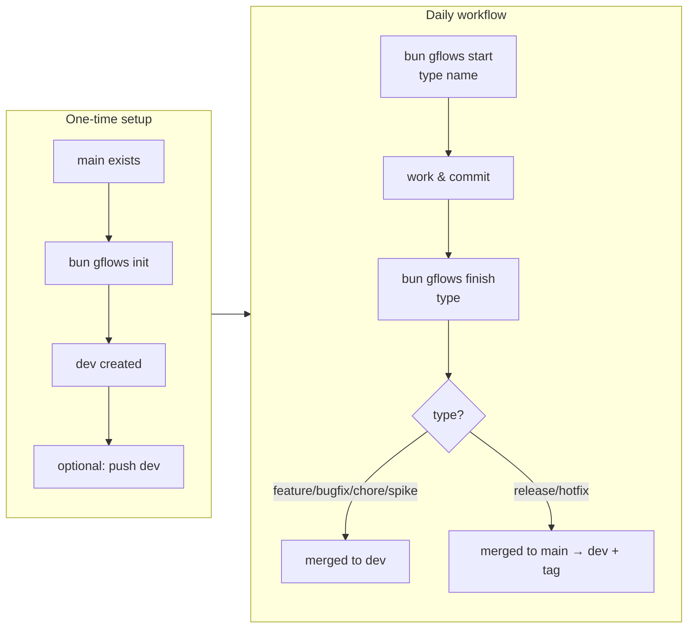
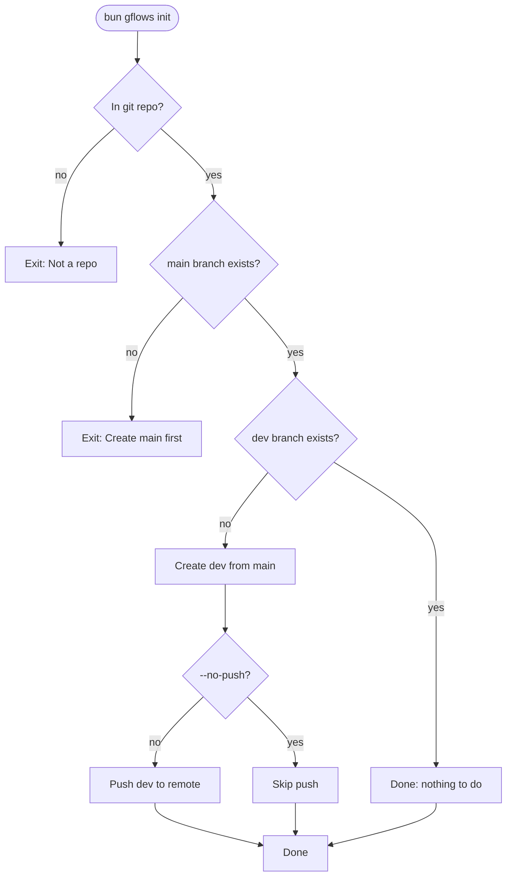
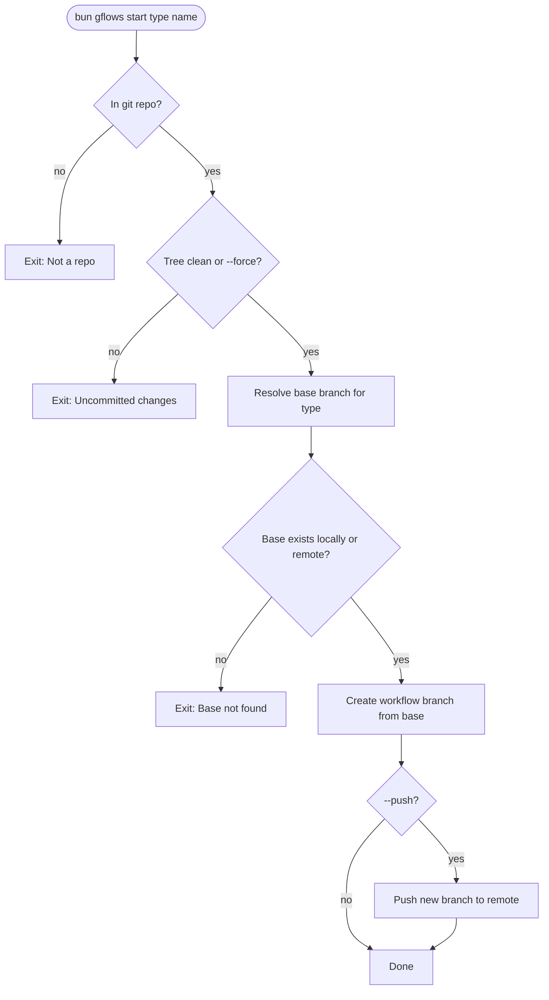
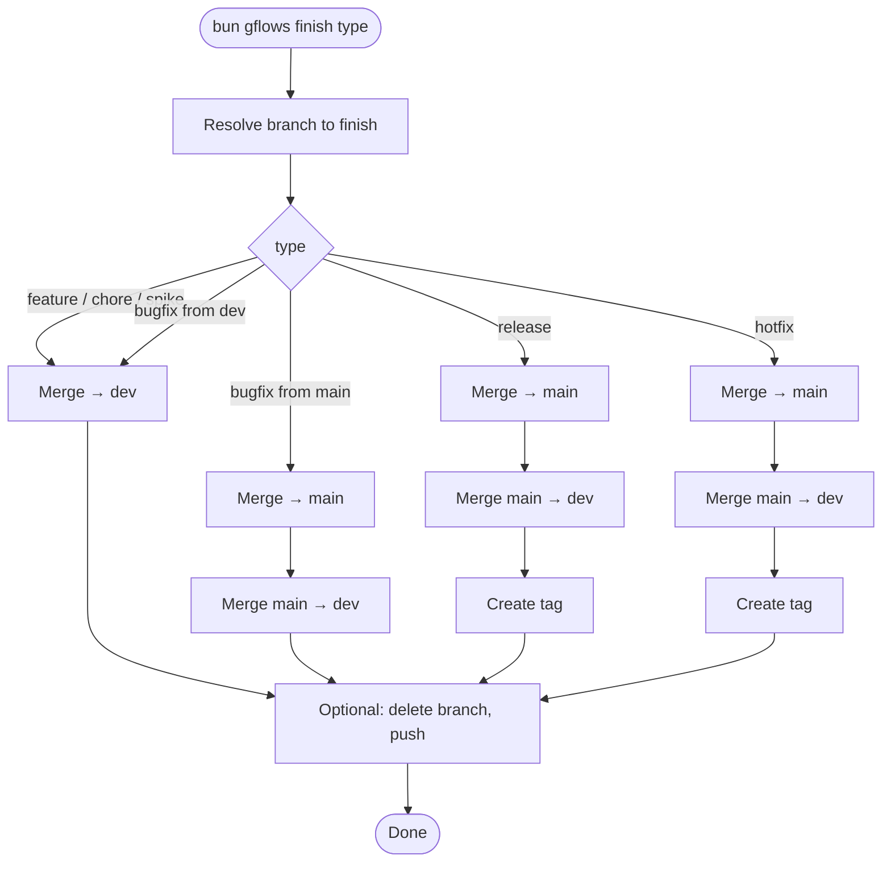
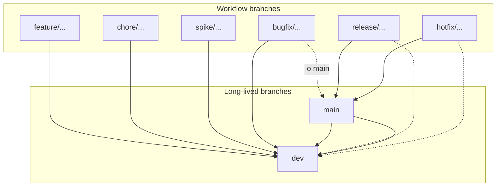
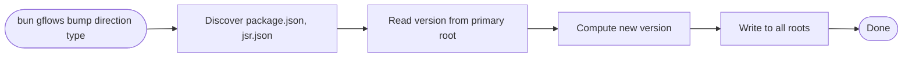

# gFlows

A lightweight CLI for consistent Git branching workflows: long-lived **main** (production) and **dev** (integration), plus short-lived workflow branches with clear merge targets. Built for [Bun](https://bun.sh) and TypeScript; **scriptable** and **safe by default**—no history rewriting, predictable exit codes, and optional interactive pickers only when running in a TTY.

**Author:** [Ali AlNaghmoush](https://github.com/alialnaghmoush) · **Repository:** [github.com/alialnaghmoush/gflows](https://github.com/alialnaghmoush/gflows)

---

## Table of contents

**Get started**

- [Prerequisites](#prerequisites)
- [Installation](#installation)
- [Quick start](#quick-start)

**Understand**

- [Concepts](#concepts)
- [Flowcharts](#flowcharts)
- [Branch types in detail](#branch-types-in-detail)

**Reference**

- [Command reference](#command-reference)

**Configure & operate**

- [Configuration](#configuration)
- [Scripting and CI](#scripting-and-ci)
- [Exit codes](#exit-codes)
- [Troubleshooting](#troubleshooting)

**More**

- [Shell completion](#shell-completion)
- [Publishing (maintainers)](#publishing-maintainers)
- [License](#license)

---

## Prerequisites

- **Bun** ≥ 1.0 (recommended). The CLI runs TypeScript directly.
- **Git** for repository operations.

Check versions:

```bash
bun --version
git --version
```

---

## Installation

**Dev dependency (recommended):** `bun add --dev gflows` or `npm install --save-dev gflows`.  
**JSR:** `npx jsr add --dev @alialnaghmoush/gflows` or `deno add --dev jsr:@alialnaghmoush/gflows`.

Run with `bunx gflows ...` or `npx gflows ...`. [npm](https://www.npmjs.com/package/gflows) · [JSR](https://jsr.io/@alialnaghmoush/gflows)

**Global:** `bun add --global gflows` or `npm install --global gflows`

---

## Quick start

**1. One-time setup** — In your repo, ensure `main` exists and create `dev`:

```bash
bun gflows init
```

Use `--no-push` to skip push, `--dry-run` to preview. Pass `--main`, `--dev`, `--remote` to persist to `.gflows.json`.

```bash
bun gflows init --main main --dev develop --remote origin
```

**2. Daily development** (feature → dev):

```bash
bun gflows start feature add-login
# ... code, commit ...
bun gflows finish feature
bun gflows finish feature --push
bun gflows finish feature --push -D
```

**3. Release** (dev → main, then tag):

```bash
bun gflows bump up minor
bun gflows start release v1.3.0
# ... update CHANGELOG, commit ...
bun gflows finish release --push
```

**4. Hotfix** (main → fix → main + dev):

```bash
bun gflows start hotfix v1.3.1
# ... fix, commit ...
bun gflows finish hotfix --push
```

---

## Concepts

- **main** — Production branch. Only release and hotfix merge here.
- **dev** — Integration branch. Feature, bugfix, chore, spike merge here. Created by `gflows init` from main.
- **Workflow branches** — Short-lived branches with a type prefix; each has a base and merge target(s). No history rewriting.
- **Merge targets:** feature/chore/spike → dev; bugfix → dev (or main with `-o main`); release/hotfix → main then dev + tag.

Override names and prefixes via [configuration](#configuration).

---

## Flowcharts

### Lifecycle (init → start → finish)



### init



### start



### finish (merge targets by branch type)



### Branch types and merge targets



### bump (version)



---

## Branch types in detail

| Type    | Short | Base (default) | With `-o main` | Merge target(s)            | Tag |
| ------- | ----- | -------------- | -------------- | -------------------------- | --- |
| feature | `-f`  | dev            | —              | dev                        | no  |
| bugfix  | `-b`  | dev            | main           | dev (or main if from main) | no  |
| chore   | `-c`  | dev            | —              | dev                        | no  |
| release | `-r`  | dev            | —              | main, then dev             | yes |
| hotfix  | `-x`  | main           | —              | main, then dev             | yes |
| spike   | `-e`  | dev            | —              | dev                        | no  |

Release and hotfix names must be a version (`vX.Y.Z` or `X.Y.Z`). Branch names use default prefixes (e.g. `feature/add-login`); override in [configuration](#configuration). Invalid names (e.g. `..`, `*`, spaces) → exit 1.

---

## Command reference

### Summary table

| Command      | Short | Description                                                               |
| ------------ | ----- | ------------------------------------------------------------------------- |
| `init`       | `-I`  | Ensure main exists; create dev from main.                                 |
| `start`      | `-S`  | Create a workflow branch (requires type + name).                          |
| `finish`     | `-F`  | Merge branch into target(s), optional tag (release/hotfix), delete, push. |
| `switch`     | `-W`  | Switch to a workflow branch (picker or name); with uncommitted changes: prompt or `--move` / `--restore` / `--clean` / `--cancel`. |
| `delete`     | `-L`  | Delete local workflow branch(es). Never main/dev.                         |
| `list`       | `-l`  | List workflow branches; optional type filter and remote.                  |
| `bump`       | —     | Bump or rollback package version (patch/minor/major).                     |
| `completion` | —     | Print shell completion script (bash/zsh/fish).                            |
| `status`     | `-t`  | Show current branch, type, base, merge target(s), ahead/behind.           |
| `help`       | `-h`  | Show usage and quick reference.                                           |
| `version`    | `-V`  | Show version.                                                             |


**Common flags:**


| Flag              | Short | Description                           |
| ----------------- | ----- | ------------------------------------- |
| `--path <dir>`    | `-C`  | Run as if in `<dir>`.                 |
| `--dry-run`       | `-d`  | Log intended actions only; no writes. |
| `--verbose`       | `-v`  | Verbose output.                       |
| `--quiet`         | `-q`  | Minimal output.                       |
| `--push`          | `-p`  | Push after init/start/finish.         |
| `--no-push`       | `-P`  | Do not push.                          |
| `--main <name>`   | —     | Main branch override.                 |
| `--dev <name>`    | —     | Dev branch override.                  |
| `--remote <name>` | `-R`  | Remote for push.                      |
| `--from <branch>` | `-o`  | Base branch override (start).         |
| `--branch <name>` | `-B`  | Branch name (finish).                 |
| `--yes`           | `-y`  | Skip confirmations.                   |


---

### init

Ensures main exists; creates dev from main if missing. Use `--main`, `--dev`, `-R` to persist to `.gflows.json`.

**Examples:**

```bash
bun gflows init
bun gflows init --main main --dev develop --remote origin
bun gflows init -C ../other-repo --dry-run
```

**Flags:**


| Flag              | Short | Description                                                   |
| ----------------- | ----- | ------------------------------------------------------------- |
| `--push`          | `-p`  | Push dev to remote after creating (default).                  |
| `--main <name>`   | —     | Main branch name (persisted to `.gflows.json` when provided). |
| `--dev <name>`    | —     | Dev branch name (persisted to `.gflows.json` when provided).  |
| `--remote <name>` | `-R`  | Remote name (persisted to `.gflows.json` when provided).      |
| `--path <dir>`    | `-C`  | Run as if in `<dir>`.                                         |
| `--dry-run`       | `-d`  | Log intended actions only; no writes.                         |
| `--verbose`       | `-v`  | Verbose output.                                               |
| `--quiet`         | `-q`  | Minimal output.                                               |


---

### start

Creates a workflow branch from the correct base. Requires type + name; release/hotfix name must be a version. Pre-checks: git repo, clean tree (or `--force`), base exists.

**Examples:**

```bash
bun gflows start feature auth-refactor
bun gflows start bugfix fix-login --from main
bun gflows start release v2.0.0
bun gflows start hotfix 1.2.1
bun gflows start feature wip --force --push
```

**Flags:**


| Flag              | Short | Description                                       |
| ----------------- | ----- | ------------------------------------------------- |
| `--force`         | —     | Allow dirty working tree.                         |
| `--push`          | `-p`  | Push new branch to remote after creating.         |
| `--from <branch>` | `-o`  | Base branch override (e.g. `-o main` for bugfix). |
| `--remote <name>` | `-R`  | Remote for push.                                  |
| `--path <dir>`    | `-C`  | Run as if in `<dir>`.                             |
| `--dry-run`       | `-d`  | Log intended actions only; no writes.             |
| `--verbose`       | `-v`  | Verbose output.                                   |
| `--quiet`         | `-q`  | Minimal output.                                   |


---

### finish

Merges the branch (current or `-B`) into its target(s). Release/hotfix: merge to main, then main → dev, create tag. Use `--no-ff` for a merge commit. On conflict, resolve then `git merge --continue` or re-run finish.

**Examples:**

```bash
bun gflows finish feature
bun gflows finish feature -B feature/auth --push -D
bun gflows finish release --push
bun gflows finish hotfix -s -T -y
```

**Flags:**


| Flag                  | Short | Description                                                                          |
| --------------------- | ----- | ------------------------------------------------------------------------------------ |
| `--branch <name>`     | `-B`  | Branch to finish (current branch if omitted; picker in TTY when `-B` with no value). |
| `--no-ff`             | —     | Always create a merge commit.                                                        |
| `--delete`            | `-D`  | Delete branch after finish.                                                          |
| `--no-delete`         | `-N`  | Do not delete branch after finish.                                                   |
| `--push`              | `-p`  | Push after merge (finish prompts "Do you want to push?" when neither `-p` nor `-P`). |
| `--no-push`           | `-P`  | Do not push.                                                                         |
| `--sign`              | `-s`  | Sign the tag (release/hotfix; GPG).                                                  |
| `--no-tag`            | `-T`  | Do not create tag (release/hotfix).                                                  |
| `--tag-message <msg>` | `-M`  | Tag message.                                                                         |
| `--message <msg>`     | `-m`  | Merge message.                                                                       |
| `--yes`               | `-y`  | Skip confirmations (e.g. "Delete branch after finish?").                             |
| `--path <dir>`        | `-C`  | Run as if in `<dir>`.                                                                |
| `--dry-run`           | `-d`  | Log intended actions only; no writes.                                                |
| `--verbose`           | `-v`  | Verbose output.                                                                      |
| `--quiet`             | `-q`  | Minimal output.                                                                      |


---

### switch

Switch to a workflow branch. With TTY and no branch name, shows a picker; otherwise pass the branch name (e.g. `gflows switch dev` or `-B dev`).

**Uncommitted changes:** If the working tree is dirty and stdin is a TTY, you are prompted to choose:

| Option | Description |
| ------ | ----------- |
| **Move** | Move current changes to the target branch. |
| **Restore** | Save changes for this branch; restore target's saved state (if any). |
| **Clean** | Discard changes and switch clean at HEAD. |
| **Cancel** | Abort switching. |

You can skip the prompt by passing exactly one of the flags below. If the target branch has saved changes and you use **Clean**, a warning is shown (unless `-q`).

**Examples:**

```bash
bun gflows switch
bun gflows switch feature/auth-refactor
bun gflows switch dev --restore
bun gflows switch main --clean
bun gflows -W feature/auth-refactor
```

**Flags:**


| Flag           | Short | Description                                                                 |
| -------------- | ----- | --------------------------------------------------------------------------- |
| `--path <dir>` | `-C`  | Run as if in `<dir>`.                                                      |
| `--branch <name>` | `-B` | Branch to switch to (alternative to positional).                           |
| `--move`       | —     | Move current changes to the target branch; no prompt.                       |
| `--restore`    | —     | Save for this branch; restore target's saved state (if any); no prompt.     |
| `--clean`      | —     | Discard changes and switch clean at HEAD; no prompt.                       |
| `--cancel`     | —     | Abort switching; no prompt.                                                |
| `--verbose`    | `-v`  | Verbose output.                                                            |
| `--quiet`      | `-q`  | Minimal output (suppresses Clean warning about saved changes on target).  |


---

### delete

Delete local workflow branch(es). Never deletes main/dev. TTY: picker; otherwise pass branch name(s).

**Examples:**

```bash
bun gflows delete
bun gflows delete feature/old-spike
bun gflows delete feature/one feature/two
```

**Flags:**


| Flag           | Short | Description           |
| -------------- | ----- | --------------------- |
| `--path <dir>` | `-C`  | Run as if in `<dir>`. |
| `--verbose`    | `-v`  | Verbose output.       |
| `--quiet`      | `-q`  | Minimal output.       |


---

### list

List workflow branches (one per line). Filter by type; use `-r` to include remote (may run `git fetch`).

**Examples:**

```bash
bun gflows list
bun gflows list feature
bun gflows list -r
```

**Flags:**


| Flag               | Short | Description                                             |
| ------------------ | ----- | ------------------------------------------------------- |
| `--include-remote` | `-r`  | Include remote-tracking branches (may run `git fetch`). |
| `--path <dir>`     | `-C`  | Run as if in `<dir>`.                                   |
| `--dry-run`        | `-d`  | Log intended actions only.                              |
| `--verbose`        | `-v`  | Verbose output.                                         |
| `--quiet`          | `-q`  | Minimal output.                                         |


---

### bump

Bump or rollback version in `package.json` and `jsr.json` (monorepo: all discovered roots). No git operations. Direction: `up`|`down`; type: `patch`|`minor`|`major`. TTY: interactive; non-TTY: both required.

**Examples:**

```bash
bun gflows bump up patch
bun gflows bump down minor
bun gflows bump --dry-run
```

**Flags:**


| Flag           | Short | Description                                   |
| -------------- | ----- | --------------------------------------------- |
| `--dry-run`    | `-d`  | Print old → new version only; no file writes. |
| `--path <dir>` | `-C`  | Run as if in `<dir>`.                         |
| `--verbose`    | `-v`  | Verbose output.                               |
| `--quiet`      | `-q`  | Minimal output.                               |


---

### status

Shows current branch, type, base, merge target(s), ahead/behind. Read-only.

**Examples:**

```bash
bun gflows status
bun gflows -t
```

**Flags:**


| Flag           | Short | Description           |
| -------------- | ----- | --------------------- |
| `--path <dir>` | `-C`  | Run as if in `<dir>`. |
| `--verbose`    | `-v`  | Verbose output.       |
| `--quiet`      | `-q`  | Minimal output.       |


---

### completion

Prints completion script for bash/zsh/fish. See [Shell completion](#shell-completion).

### help & version

`bun gflows help` · `bun gflows -V`

---

## Configuration

Optional. Override main, dev, remote, prefixes. Resolution: defaults → `.gflows.json` or `package.json` "gflows" key → CLI flags. Invalid config is ignored (`-v` for warning).

### Example: `.gflows.json` (full)

```json
{
  "main": "main",
  "dev": "dev",
  "remote": "origin",
  "prefixes": {
    "feature": "feature/",
    "bugfix": "bugfix/",
    "chore": "chore/",
    "release": "release/",
    "hotfix": "hotfix/",
    "spike": "spike/"
  }
}
```

### Example: minimal

```json
{ "main": "master", "dev": "develop" }
```

Or in `package.json`: `"gflows": { "main": "main", "dev": "development", "remote": "upstream" }`

---

## Scripting and CI

Non-TTY: no pickers; pass branch names explicitly. Use `-y` to skip confirmations. Exit codes: 0 success, 1 validation, 2 Git/state. Use `-C <dir>` to run in another directory.

```bash
bun gflows finish feature -B feature/add-login --push -y
bun gflows list feature | while read -r b; do echo "$b"; done
bun gflows -C ./packages/api list
```

---

## Exit codes

| Code  | Meaning            | Typical causes                                                                                                                                                                                                      |
| ----- | ------------------ | ------------------------------------------------------------------------------------------------------------------------------------------------------------------------------------------------------------------- |
| **0** | Success            | Command completed without error.                                                                                                                                                                                    |
| **1** | Usage / validation | Missing type or name for `start`; invalid branch name or version; wrong/missing positionals when not TTY.                                                                                                           |
| **2** | Git / system       | Not a repo; branch not found; dirty tree; merge conflict; rebase/merge in progress; detached HEAD; finish on main/dev; tag exists; push failed.                                                                   |

---

## Troubleshooting

| Situation                                          | What to do                                                                                                                                                                  |
| -------------------------------------------------- | --------------------------------------------------------------------------------------------------------------------------------------------------------------------------- |
| **"Not a Git repository"**                         | Run from a directory that contains `.git`, or use `-C <path>` to point to the repo root.                                                                                    |
| **"Working tree has uncommitted changes"**         | Commit or stash changes before `start`, or use `--force` (only when you intend to carry uncommitted work).                                                                  |
| **"Merge conflict while merging into …"**          | Resolve conflicts in your working tree, then run `git add` and `git merge --continue` (or `git merge --abort` to cancel). Re-run `gflows finish` after resolving if needed. |
| **"Tag v1.2.3 already exists"**                    | Use a new version for the release/hotfix, or delete/move the tag if you know what you’re doing. gflows does not overwrite tags.                                             |
| **"Cannot finish the long-lived branch main/dev"** | You’re on main or dev. Checkout a workflow branch first, or use `-B <branch>` to finish another branch.                                                                     |
| **"HEAD is detached"**                             | Checkout a branch (e.g. `git checkout dev`) before running `start` or `finish`.                                                                                             |
| **"A rebase or merge is in progress"**             | Run `git rebase --abort` or `git merge --abort`, or complete the operation, then retry gflows.                                                                              |
| **Picker not showing / "requires branch name"**    | Without a TTY, gflows does not show interactive pickers. Pass the branch name explicitly (e.g. `-B feature/xyz` or `gflows switch feature/xyz`).                            |
| **Wrong remote or branch names**                   | Use `.gflows.json` or `package.json` "gflows" key, or `gflows init --main … --dev … --remote …`. Use `-R` for one-off remote override.                                      |


Use `-v` for verbose git commands and diagnostics.

---

## Shell completion

**Bash:**

```bash
source <(bun gflows completion bash)
echo 'source <(bun gflows completion bash)' >> ~/.bashrc
```

**Zsh:**

```bash
source <(bun gflows completion zsh)
echo 'source <(bun gflows completion zsh)' >> ~/.zshrc
```

**Fish:**

```bash
bun gflows completion fish | source
bun gflows completion fish > ~/.config/fish/completions/gflows.fish
```

---

## Publishing (maintainers)

Internal script `scripts/publish.ts`: syncs version from package.json to jsr.json, then publishes to npm and/or JSR. Not in published package.

```bash
bun run publish:all
bun run publish:all -- --dry-run
bun run publish:npm
bun run publish:jsr
bun run publish:all -- --force
```

### Typical release workflow

1. Ensure you’re on **main** with a clean working tree (or use `--force` when intentional).
2. Bump version and tag in Git yourself, or use gflows bump + your own commit:
  ```bash
   gflows bump up minor --dry-run   # confirm
   gflows bump up minor
   git add package.json jsr.json && git commit -m "chore: bump to 1.4.0"
  ```
3. Run the publish script:
  ```bash
   bun run publish:all -- --dry-run # verify
   bun run publish:all
  ```
4. Optionally push main and tags:
  ```bash
   git push origin main --tags
  ```

**Version sync:** The script reads `version` from **package.json** and writes it to **jsr.json** before publishing so the two registries never drift. Use `**gflows bump`** to change the version; the script does not bump for you.

### JSR score (100%)

To get a 100% score on [JSR](https://jsr.io/@alialnaghmoush/gflows/score):

1. **Description** — Set in `jsr.json` (already added). If the score still shows 0/1, set the description in [package settings](https://jsr.io/@alialnaghmoush/gflows/settings) on JSR.
2. **Runtime compatibility** — In [package settings](https://jsr.io/@alialnaghmoush/gflows/settings), open “Runtime compatibility” and mark at least **Bun** and **Node.js** (or others) as **Supported**.
3. **Provenance** — The repo includes `[.github/workflows/publish.yml](.github/workflows/publish.yml)` (test, lint, then publish to npm and JSR). In JSR package settings, **link** the package to this GitHub repository. Add `NPM_TOKEN` in repo Secrets for npm. After that, pushes to `main` run CI and publish both registries; JSR records provenance.

---

## License

See [LICENSE](LICENSE) in this repository.